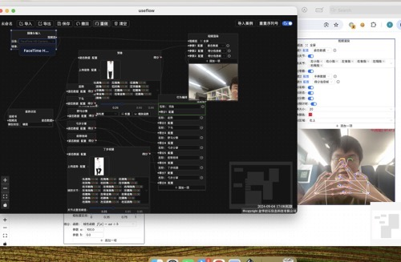
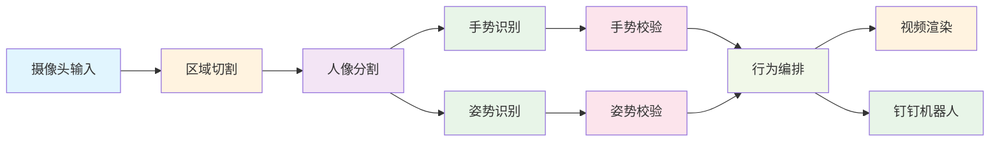
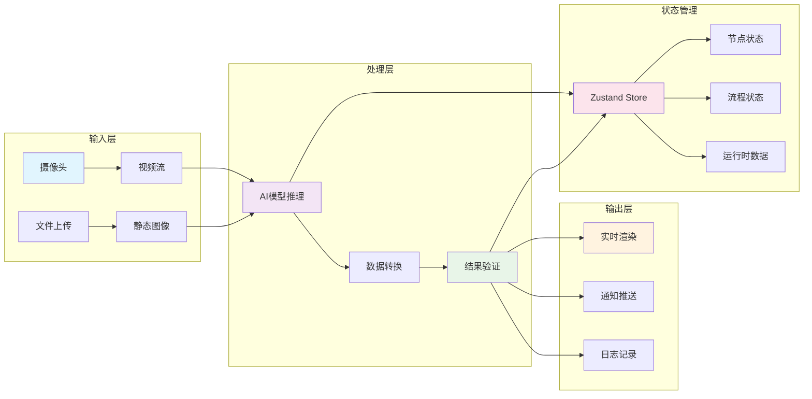

# UseFlow - 视觉化AI流程编排平台

<div align="center">
    
  [](https://www.gnu.org/licenses/agpl-3.0)
  [](https://www.typescriptlang.org/)
  [](https://reactjs.org/)
  [](https://www.electronjs.org/)
</div>

## 🖥️ 应用预览

<div align="center">
  <a href="https://v.douyin.com/na6THmE5M3Q/">
    
  </a>
  <p><em>点击观看UseFlow完整功能演示视频</em></p>
</div>

## 📖 项目介绍

UseFlow 是一个基于可视化节点编辑器的AI流程编排平台，专注于计算机视觉和人工智能应用的快速开发与部署。通过拖拽式的节点连接，用户可以轻松构建复杂的AI处理流程，无需编写代码即可实现姿态识别、手势检测、对象识别等功能。

### 🌟 核心特性

- **🎯 零代码AI开发** - 通过可视化节点编辑器快速构建AI流程
- **🤖 丰富的AI模型** - 集成TensorFlow.js和MediaPipe，支持多种AI能力
- **📱 跨平台部署** - 支持Web、桌面端(Electron)、移动端(Capacitor)
- **⚡ 实时处理** - 基于WebGL/WebGPU的高性能实时视频处理
- **🔄 流程管理** - 支持多流程管理、导入导出、历史记录
- **🎨 现代UI** - 基于Ant Design的现代化界面，支持暗黑/明亮主题

## 🚀 快速开始

### 环境要求

- Node.js 16.0+
- npm 或 yarn 或 pnpm

### 安装依赖

```bash
# 克隆项目
git clone https://github.com/your-repo/useflow.git
cd useflow

# 安装依赖
npm install
# 或
yarn install
# 或
pnpm install
```

### 启动开发服务器

```bash
# Web版本
npm run dev

# 桌面版本
npm run electron:dev
```

### 构建生产版本

```bash
# Web版本
npm run build

# 桌面版本
npm run electron:build

# Android版本
npm run android:build
```

## 🧩 节点类型

### 流式输入输出
- **摄像头输入** - 获取摄像头视频流
- **区域切割** - 对视频流进行区域裁剪
- **人像分割** - 基于MediaPipe的人像分割
- **对象识别** - 基于COCO-SSD的对象检测与跟踪
- **视频渲染** - 实时视频渲染与可视化
- **转换脚本** - 自定义数据转换处理

### 动作识别
- **姿势识别** - 基于BlazePose的人体姿态检测
- **姿势校验** - 姿态匹配与评分算法
- **手势识别** - 基于MediaPipe的手势检测
- **手势校验** - 手势匹配与验证
- **关节偏移** - 关节位置校正与优化

### 编排控制
- **行为编排** - 复杂动作序列的编排与控制
- **日志记录** - 流程执行日志与调试信息

### 预警通知
- **钉钉机器人** - 集成钉钉机器人推送通知

## 🛠️ 技术架构

### 前端技术栈
- **React 18** - 现代化UI框架
- **TypeScript** - 类型安全的开发体验
- **Vite** - 快速的构建工具
- **Ant Design** - 企业级UI组件库
- **React Flow** - 可视化节点编辑器
- **Zustand** - 轻量级状态管理

### AI/ML 技术栈
- **TensorFlow.js** - 浏览器端机器学习
- **MediaPipe** - 跨平台AI框架
- **WebGL/WebGPU** - 硬件加速计算
- **COCO-SSD** - 对象检测模型
- **BlazePose** - 人体姿态估计

### 跨平台技术
- **Electron** - 桌面应用开发
- **Capacitor** - 移动应用开发
- **PWA** - 渐进式Web应用

## 📁 项目结构


### 详细目录结构

```
useflow/
├── src/
│   ├── components/          # 可复用组件
│   │   ├── PoseDetector.tsx # 姿态检测组件
│   │   ├── ObjectDetector.tsx # 对象检测组件
│   │   ├── BodySegmenter.tsx # 人像分割组件
│   │   └── ...
│   ├── nodes/              # 节点类型定义
│   │   ├── CameraInput.tsx  # 摄像头输入节点
│   │   ├── PoseDetection.tsx # 姿态检测节点
│   │   ├── ObjectDetection.tsx # 对象检测节点
│   │   └── ...
│   ├── flows/              # 流程管理
│   │   └── UseFlow.tsx     # 主流程编辑器
│   ├── edges/              # 连接线组件
│   └── App.tsx             # 主应用组件
├── public/                 # 静态资源
│   ├── ssdlite_mobilenet_v2/ # 对象检测模型
│   └── pose-detection-lib/   # 姿态检测资源
├── main.js                 # Electron主进程
├── capacitor.config.json   # Capacitor配置
└── vite.config.ts         # Vite配置
```

## 🎮 使用指南

### 创建新流程

1. 启动应用后，点击标题栏的"+"按钮创建新流程
2. 右键点击画布，从上下文菜单选择所需节点
3. 拖拽节点到画布上，通过连接点连接不同节点
4. 配置各节点的参数，点击保存按钮保存流程

### 基础流程示例

#### 复杂AI处理流程



### 数据流架构



### 流程管理

- **导入/导出**: 支持.useflow格式的流程文件
- **多流程管理**: 可同时管理多个流程项目
- **历史记录**: 支持撤销/重做操作
- **实时预览**: 节点参数修改后实时生效

## 🔧 配置说明

### 模型配置

应用内置多种AI模型，支持以下配置:

- **姿态检测**: BlazePose (lite/full/heavy)
- **手势检测**: MediaPipe Hands (lite/full)
- **对象检测**: COCO-SSD (自定义置信度阈值)
- **人像分割**: MediaPipe Selfie Segmentation (general/landscape)

### 性能优化

- 默认使用WebGL后端，支持WebGPU加速
- 支持模型缓存，减少重复加载时间
- 内置对象跟踪算法，提高检测稳定性

## 📝 开发指南

### 添加新节点

1. 在`src/nodes/`目录创建新的节点组件
2. 在`src/nodes/index.ts`中注册新节点
3. 实现节点的输入输出接口和UI配置

### 自定义AI模型

1. 在`src/components/`目录添加模型封装组件
2. 使用`useRuntimeNodeStore`管理节点间的数据流
3. 集成到对应的处理节点中

## 🤝 贡献指南

欢迎提交Issue和Pull Request来改进项目！

1. Fork本项目
2. 创建特性分支 (`git checkout -b feature/AmazingFeature`)
3. 提交更改 (`git commit -m 'Add some AmazingFeature'`)
4. 推送到分支 (`git push origin feature/AmazingFeature`)
5. 创建Pull Request

## 📄 许可证

本项目采用 [AGPL-3.0](https://www.gnu.org/licenses/agpl-3.0) 许可证。

## 🏢 开发团队

**金华岩石信息科技有限公司**

- 📧 联系邮箱: zzchun12826@gmail.com
- 💬 微信: zzchun12826

## 🔗 相关链接

- [TensorFlow.js](https://www.tensorflow.org/js)
- [MediaPipe](https://mediapipe.dev/)
- [React Flow](https://reactflow.dev/)
- [Ant Design](https://ant.design/)
- [Electron](https://www.electronjs.org/)
- [Capacitor](https://capacitorjs.com/)

---

<div align="center">
  <p>Built with ❤️ by UseFlow Team</p>
</div>
